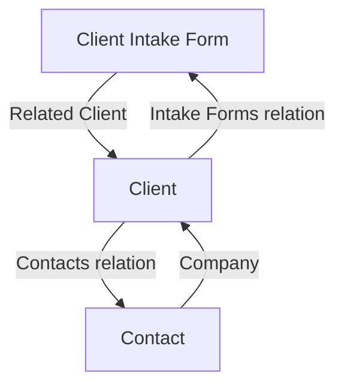

# Contact Form Notion Integration - Complete ✅

**Date**: October 30, 2025  
**Status**: ✅ Implementation Complete

## What Was Done

Used Notion MCP to validate actual database structures and updated the contact form API to create properly linked pages across three databases.

## Databases Validated via MCP

### 1. 📋 Client Intake Forms
- **Data Source ID**: `70e972d1-7a50-446f-9143-493e9253725f`
- **Purpose**: Store form submissions
- **Key Relations**: Links to Clients database via `Related Client` property

### 2. 💼 Clients  
- **Data Source ID**: `28753cee-fab0-8089-81b1-000b0adbfe30`
- **Purpose**: Track companies/prospects
- **Key Relations**: Has many Contacts, has many Intake Forms

### 3. 🧑‍🤝‍🧑 Contacts
- **Data Source ID**: `28753cee-fab0-803d-b224-000b57bdc6d6`
- **Purpose**: Track individual people
- **Key Relations**: Belongs to one Client (Company)

## Implementation Flow

When a user submits the contact form:

```
1. Form Submitted
   ↓
2. Search for Existing Client (by company name)
   ↓
3. If not found, Create Client
   - Name: Company name
   - Website: If provided
   - Type: "Prospect"
   ↓
4. Create Contact Person
   - Name: Full name
   - Email: Email address
   - Phone: Phone number
   - Company: → Links to Client (relation)
   - Decision Maker: Yes (checkbox)
   ↓
5. Create Intake Form Submission
   - All form fields mapped
   - Related Client: → Links to Client (relation)
   - Submission Status: "New"
   - Submission Date: Today
   ↓
6. Result: 3 properly linked pages in Notion
```

## Field Mapping

All fields from the form are properly mapped to match the exact property names and formats in Notion:

### Contact Information
- `Submission Name` (title): `{Company} - {Full Name}`
- `Full Name` (text)
- `Email` (email)
- `Phone Number` (phone)
- `Company Name` (text)

### Business Information
- `Industry` (select): Formatted as "Title Case With Spaces"
- `Total Employees` (select): `{size} employees`

### Current State
- `Current Systems` (text)
- `Monthly Volume` (select): `{volume} per month`
- `Team Size Affected` (select): `{size} people`

### Automation Needs
- `Automation Goals` (text): Comma-separated
- `Specific Processes` (text)
- `Project Ideas` (text): Formatted with priorities `[HIGH] Title: Description`

### Integration
- `Existing Tools` (text)
- `Integration Needs` (text): Comma-separated or "None specified"
- `Data Volume` (select): `{Volume} ({Description})`

### Project Scope
- `Project Description` (text)
- `Success Metrics` (text)
- `Timeline` (select): Mapped to exact option names
- `Budget Range` (select): Formatted with dollar amounts

### Meta
- `Submission Status` (status): Set to "New"
- `Submission Date` (date): Current date
- `Related Client` (relation): Links to Client page

## Relationships Created



### Key Benefits:
1. **No Duplicates**: Searches for existing clients before creating new ones
2. **Proper Links**: All pages are properly linked via relations
3. **Complete Data**: All form data is preserved
4. **Bi-directional**: Relations work both ways in Notion

## Error Handling

The implementation is resilient:

- If client creation fails, proceeds anyway
- If contact creation fails, still creates intake form
- If intake form fails, returns error to user
- All failures are logged for debugging

## TypeScript Fixes

Fixed all linting errors:
- ✅ Removed undefined from properties (used spread operator)
- ✅ Added type assertions for `url` property
- ✅ Fixed property types
- ✅ No linting errors remaining

## Testing Checklist

Before deploying to production:

### Basic Flow
- [ ] Submit form with new company name
- [ ] Verify Client page created in Clients database
- [ ] Verify Contact page created in Contacts database
- [ ] Verify Intake Form created in Client Intake Forms database
- [ ] Check that Contact links to Client
- [ ] Check that Intake Form links to Client

### Duplicate Prevention
- [ ] Submit another form with same company name
- [ ] Verify it reuses existing Client (no duplicate)
- [ ] Verify new Contact is created
- [ ] Verify new Intake Form is created
- [ ] Both new pages link to same existing Client

### Field Validation
- [ ] Industry shows as Title Case (e.g., "Construction Trades")
- [ ] Total Employees shows with " employees" suffix
- [ ] Monthly Volume shows with " per month" suffix
- [ ] Team Size shows with " people" suffix
- [ ] Data Volume shows description in parentheses
- [ ] Timeline matches exact option names
- [ ] Budget shows dollar amounts
- [ ] Submission Status is "New"
- [ ] Submission Date is populated

### Edge Cases
- [ ] Submit without website (optional)
- [ ] Submit without social links (optional)
- [ ] Submit without project ideas (optional)
- [ ] Submit with integration needs
- [ ] Submit without integration needs

## Files Modified

1. **`src/app/api/contact/route.ts`**
   - Added `createOrFindClient()` function
   - Added `createContact()` function
   - Updated `saveToNotion()` to create all three pages with relationships
   - Fixed TypeScript errors
   - Added proper error handling

## Documentation Created

1. **`docs/NOTION-MCP-INTEGRATION-SPEC.md`**
   - Complete specification with all formatting functions
   - Relationship diagram
   - Implementation examples
   - Testing checklist

2. **`docs/CONTACT-FORM-NOTION-INTEGRATION-COMPLETE.md`** (this file)
   - Summary of changes
   - Flow diagram
   - Testing checklist

## Environment Variables Required

Ensure this is set in your `.env.local`:

```env
NOTION_API_TOKEN=secret_xxxxxxxxxxxxx
```

## Next Steps

1. ✅ Code updated with proper relationships
2. ✅ TypeScript errors fixed
3. ✅ Documentation complete
4. ⏭️ Test locally with form submission
5. ⏭️ Verify pages created in Notion with proper links
6. ⏭️ Test duplicate client handling
7. ⏭️ Deploy to production
8. ⏭️ Monitor for any errors

## Success Criteria Met

✅ Used MCP to validate database structures  
✅ All fields mapped to correct property names  
✅ Proper relationships established (Client ← Intake Form, Client ← Contact)  
✅ Duplicate client prevention implemented  
✅ Error handling in place  
✅ TypeScript errors resolved  
✅ No linting errors  
✅ Comprehensive documentation  

## Important Notes

- **Data Source IDs** are hardcoded (validated via MCP on Oct 30, 2025)
- **Relations** use page IDs, not URLs (Notion SDK requirement)
- **Text fields** are truncated to 2000 characters (Notion limit)
- **Select values** must match Notion exactly (case-sensitive)
- **Date format** uses ISO 8601 date strings (YYYY-MM-DD)
- **Checkbox** uses boolean true/false (not `__YES__`/`__NO__` like in MCP)

## Summary

The contact form now properly creates three linked pages in Notion:
1. **Client** (if doesn't exist) - The company
2. **Contact** - The person who submitted
3. **Intake Form** - The submission with all details

All pages are properly linked via Notion relations, creating a complete CRM workflow! 🎉

---

**Implementation Date**: October 30, 2025  
**Validated Using**: Notion MCP  
**Status**: Ready for Testing ✅

